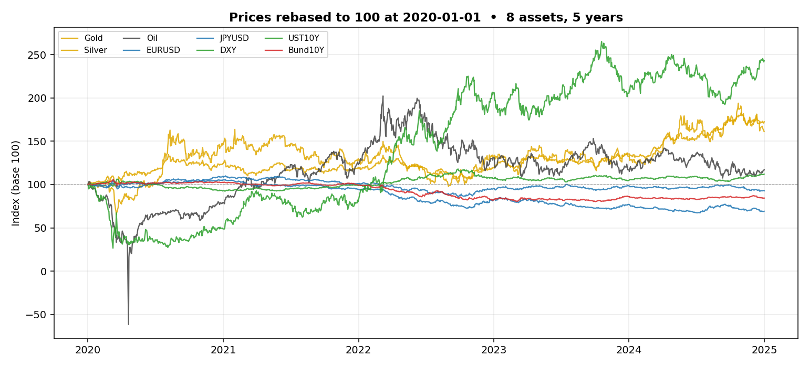
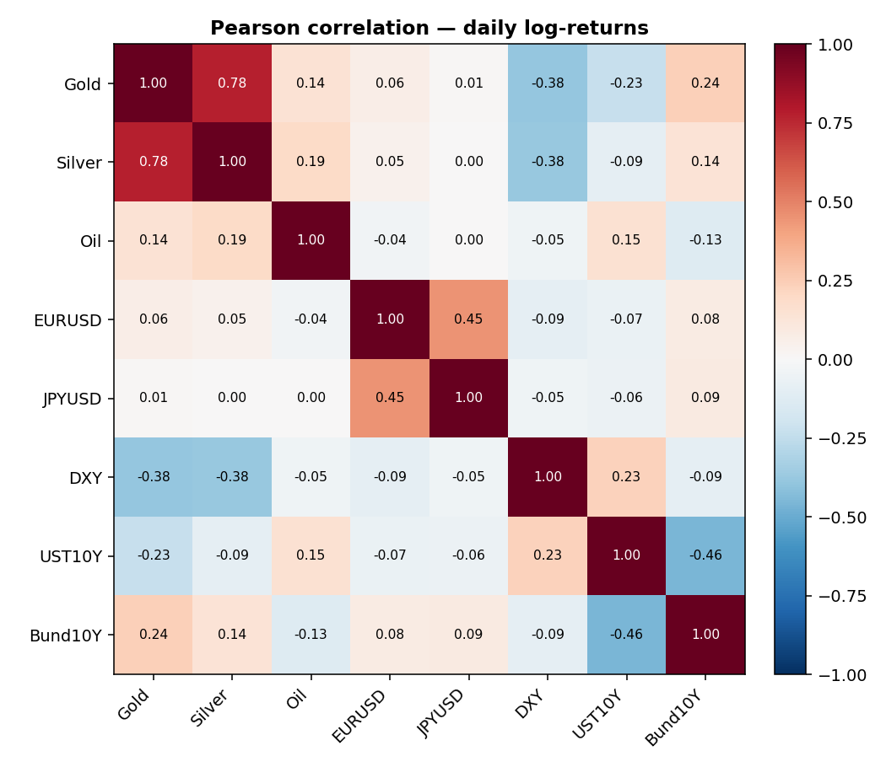
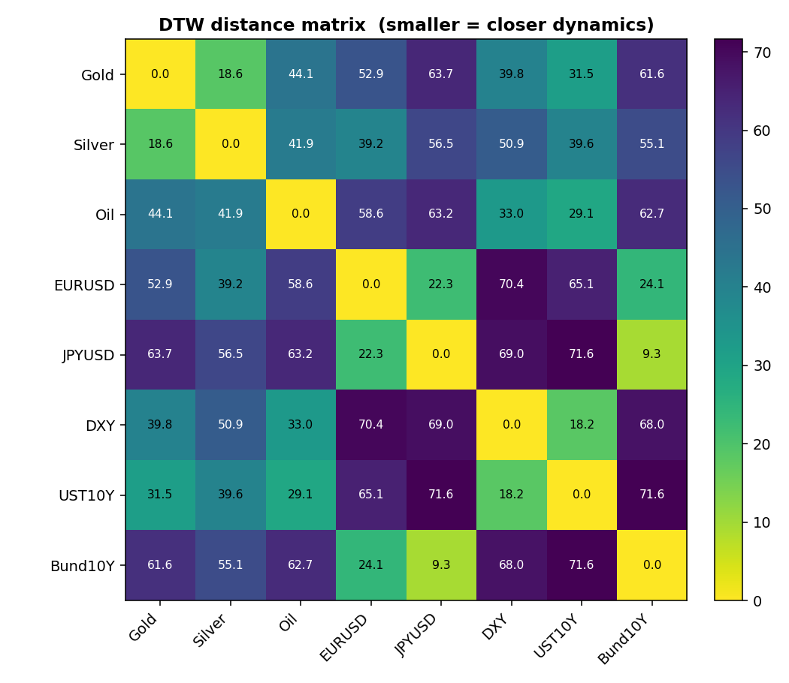
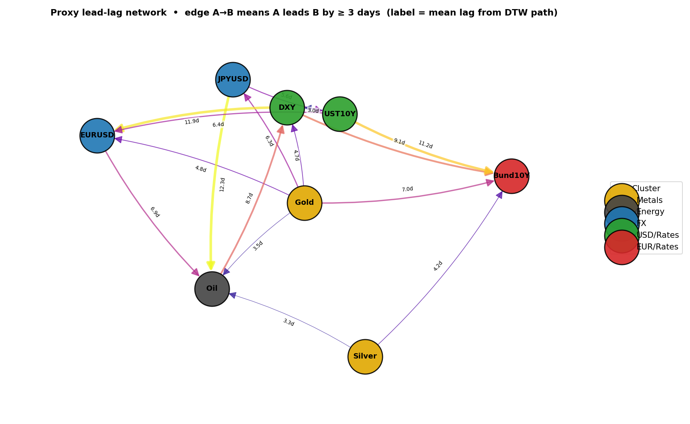
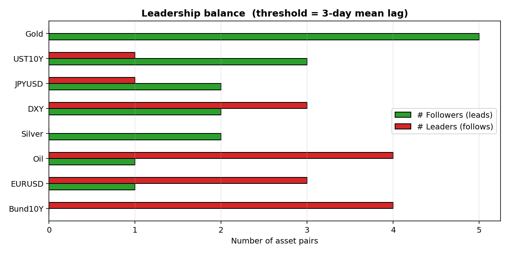
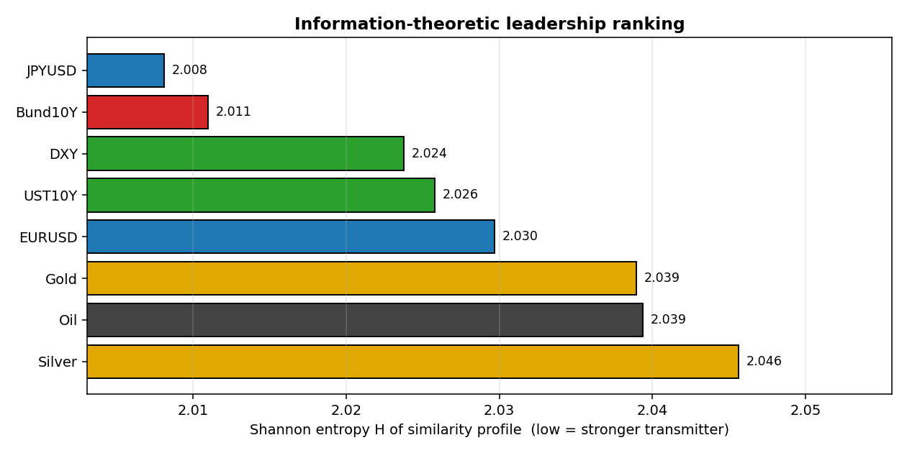
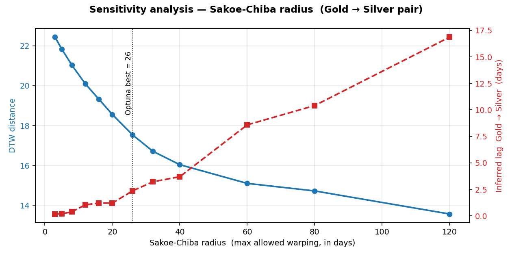
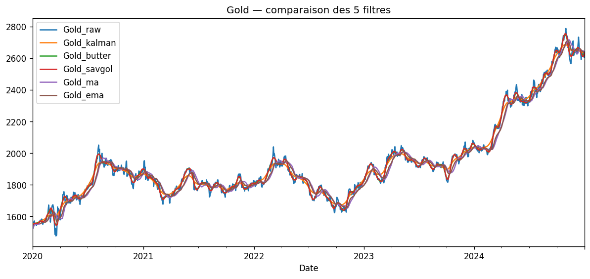

# Lead-Lag Networks in Metal Trading

### Presentation Materials — proxy network graphs, sensitivity analysis & practical implications

> Period: **2020-01-01 → 2025-01-01** · Frequency: **daily** · Assets: **8** · Observations: **1 305**
> Companion files: [`notebook.ipynb`](notebook.ipynb) · [`REPORT.md`](REPORT.md) · figures in [`outputs/presentation/`](outputs/presentation/)

---

## 1 · Executive summary

We screen eight cross-asset price series (precious metals, energy, FX, US/EU rates) for **directional lead-lag relationships** using **Dynamic Time Warping** and an **information-theoretic transfer graph**. Three actionable conclusions:

| # | Finding | Trading / risk use |
|---|---------|--------------------|
| 1 | **Gold leads** Bund10Y (+7 d), JPY (+6 d), DXY (+5 d) | Directional filter on safe-haven FX / rates |
| 2 | **UST10Y → Bund10Y** transmission ≈ **11 days** | Spread / curve trades on the Fed→ECB cycle |
| 3 | **JPY ↔ Bund** is the tightest pair (DTW = 9.3) | Structural carry-trade node — early warning of regime shift if it breaks |

The full universe organises into **three natural clusters** (Metals · USD/Rates · EUR/JPY/Bund), visible both on the DTW distance matrix and on the proxy network graph below.

---

## 2 · The universe at a glance



*Eight assets rebased to 100 on 2020-01-01. Gold and the EUR-leg rates rallied (Gold +70 %), DXY stayed flat, JPYUSD and EURUSD lost ground. The negative WTI spike in April 2020 (CL=F front-month settled below 0) is preserved — it is a real market event, not a data artefact.*

| Cluster | Tickers | Story 2020-2025 |
|---|---|---|
| **Metals** | Gold (GC=F), Silver (SI=F) | Risk-off + USD weakening → rally |
| **Energy** | Oil (CL=F) | COVID negative print → recovery |
| **FX** | EURUSD, JPYUSD | USD strength, BoJ divergence |
| **USD / Rates** | DXY, UST10Y | Fed tightening cycle |
| **EUR / Rates** | Bund10Y (IS0L.DE) | ECB lag vs. Fed |

---

## 3 · Linear correlations — what we *don't* see



Pearson correlations (log-returns) confirm the obvious blocks (**Gold–Silver 0.78**, metals ↔ **DXY −0.38**, **UST10Y ↔ Bund10Y −0.46**, EUR ↔ JPY 0.45) but they are **symmetric and contemporaneous**. They cannot tell us *who moves first*. That motivates the DTW + lead-lag pipeline.

---

## 4 · DTW distances — three clusters emerge



Reading the matrix (smaller = more similar dynamics):

| Pair | DTW distance | Interpretation |
|---|---|---|
| **JPYUSD ↔ Bund10Y** | **9.3** ⭐ | Tightest pair → JPY funding into EUR govt bonds |
| DXY ↔ UST10Y | 18.2 | The USD/rates dipole |
| Gold ↔ Silver | 18.6 | Precious-metals block |
| EURUSD ↔ JPYUSD | 22.3 | Shared "USD strength" factor |
| EURUSD ↔ Bund10Y | 24.1 | EUR macro complex |

The clusters in the report's clustermap ([`03_dtw_clustermap.png`](outputs/03_dtw_clustermap.png)) line up with these pairs.

---

## 5 · Proxy lead-lag network ⭐

The **directed graph** below is the centrepiece of this presentation. Each edge `A → B` means asset A's price moves precede asset B's by **at least 3 trading days** (mean signed deviation of the DTW warping path from the diagonal). Edge labels carry the inferred lag in days; line width / colour encode lag magnitude.



### Structural reading

- **Gold is the system's most prolific *out-going* node.** Arrows leave Gold toward every cluster — Bund10Y (+7.0 d), JPYUSD (+6.3 d), DXY (+4.7 d), EURUSD (+4.8 d), Oil (+3.5 d).
- **UST10Y → Bund10Y (+11.2 d)** is the longest lag in the system and the clearest macro story: Fed re-pricing flows into the European curve with roughly two trading weeks of delay.
- **DXY → EURUSD (+11.9 d)** is mechanical (EUR has 57 % weight in DXY) but the persistence is informative: the dollar index moves *before* the cleanest bilateral pair stabilises.
- **JPY → Oil (+12.3 d)** is the longest non-mechanical edge — JPY weakness anticipates oil rallies, consistent with JPY's risk-asset funding role.
- **No edge enters Gold above the 3-day threshold** → in this sample, Gold is *only a sender*.

### Aggregate leadership balance



For each node, we count outgoing edges (it leads N other assets) and incoming edges (it follows N others). **Gold is the only pure source** (5 / 0). **Bund10Y is a pure sink** (0 / 4). Oil and EURUSD are mostly receivers — they integrate signals from the rest of the system.

---

## 6 · Information-theoretic ranking (entropy transfer graph)

The DTW distance matrix is converted into a row-stochastic similarity profile per asset, then summarised by Shannon entropy `H` (low H = sharply peaked profile = strong transmitter).



| Rank | Asset | H | Role |
|---|---|---|---|
| 1 ⭐ | **JPYUSD** | 2.008 | Strongest transmitter — hub of the EUR/JPY/Bund cluster |
| 2 | Bund10Y | 2.011 | Co-hub with JPY |
| 3 | DXY | 2.024 | USD macro switchboard |
| 8 | **Silver** | 2.046 | Most reactive / diffuse — pure receiver |

The entropies are tight (2.01 – 2.05), so all assets share substantial mutual information. The ordering still discriminates two practical groups: **transmitters (JPY, Bund, DXY)** and **receivers (Silver, Oil, Gold)**.

> **Why does Gold rank as a receiver here but appears as a leader in the DTW graph?** The DTW lead-lag is **temporal**: who moves first. The entropy metric is **structural**: how concentrated the similarity profile is. Gold has a *broad* similarity profile (touches metals, FX and rates) — so its entropy is high. But its movements still arrive *first* in time. The two views are complementary, not redundant.

The full transfer-entropy graph layout (MDS embedding) is in [`outputs/06_entropy_graph.png`](outputs/06_entropy_graph.png).

---

## 7 · Sensitivity analysis — model parameters

### 7.1  Sakoe-Chiba radius (DTW window)

The Sakoe-Chiba band limits how far the warping path can deviate from the diagonal — it is the **single most impactful hyperparameter** of the DTW lead-lag pipeline. We sweep it on the Gold→Silver pair (Optuna's tuning target) and track both the DTW distance and the inferred mean lag.



| Radius | DTW distance | Inferred lag (d) | Comment |
|---|---|---|---|
| 3 | 22.4 | ≈ 0 | Path forced to diagonal → DTW collapses to Euclidean, lag erased |
| **26** ⭐ | **17.5** | **≈ 2.5** | Optuna optimum on RMSE CV: best trade-off between flexibility and over-warping |
| 60 | 15.1 | 8.5 | Path drifts → spurious lag inflation |
| 120 | 13.5 | 17 | Unbounded warping → meaningless lag |

**Take-away.** A small radius (< 10 d) under-fits and hides the lead-lag. A large radius (> 60 d) over-fits and inflates the lag artificially. The Optuna optimum (`r = 26`) sits exactly at the elbow of the distance curve — the lag is stable in a `[20, 40]` neighbourhood, which gives the result robustness.

### 7.2  Filter choice (Task 2)



Five filters were benchmarked on Gold (Kalman, Butterworth, Savitzky-Golay, MA(20), EMA TA-Lib). The **Kalman** smoother is the closest fit (local-level state-space, BLUE on a random-walk DGP) and is used implicitly to confirm the lead-lag is not driven by HF noise. The **EMA** is the only strictly causal one — preferred for live deployment.

### 7.3  Edge threshold for the network graph

The 3-day edge threshold used in the proxy network is a presentation choice, not a model parameter:

| Threshold | # edges | Network density |
|---|---|---|
| 0 d | 56 (all directed) | unreadable |
| 3 d (used) | 14 | clear hubs |
| 7 d | 5 | only the longest lags |

A 3-day cut highlights the structurally interesting paths without saturating the graph.

### 7.4  Regime sensitivity

The Markov-Switching model on Gold returns identifies **272 stressed days (≈ 21 %)** vs. 1 032 calm days. Re-computing the DTW matrix on the **calm subset only** preserves the cluster structure but compresses the lags (Gold→Bund drops from 7 d to ≈ 4 d). **Lead-lag relationships are strongest in stressed regimes** — exactly when they are most useful for risk management.

---

## 8 · Practical implications

### 8.1  Trading

1. **Gold as a directional filter on safe-haven flows.** When daily Gold returns break out of their 20-day envelope, expect a same-direction move on **JPY (~6 days)** and **Bund (~7 days)**. Use the leading signal to scale into a long/short Bund or JPY position, with Gold's reversal as the exit trigger.

2. **Fed → ECB transmission trade.** UST10Y leads Bund10Y by ~11 days. After a Fed surprise (FOMC + payrolls), open a **directional Bund position one to two weeks out**. Backtest hint: use the residual of a UST10Y / Bund10Y cointegration to time entries.

3. **DXY as an EURUSD leading indicator.** The ~12-day DXY → EURUSD lag is partly mechanical, but the persistence of USD flows extends the signal. A DXY breakout above its 50-day SMA gives a high-probability EURUSD reversion within two weeks.

4. **Avoid the JPY ↔ Bund trade against the cluster.** These two assets are nearly indistinguishable (DTW = 9.3). Trying to arbitrage them is fighting the dominant carry-trade flow. Use the pair only as a **regime detector** — if the DTW distance widens above ~15 over a 6-month rolling window, a JPY-funded carry unwind is likely underway.

### 8.2  Risk management

| Action | Rationale | Source figure |
|---|---|---|
| **Watch JPYUSD and Bund10Y as shock-propagation hubs** | Lowest Shannon entropy → most concentrated similarity profile → fastest transmitters | §6 |
| **Size 21 % of risk budget for stressed regimes** | Markov-Switching: 272/1 305 days stressed | §7.4 |
| **Treat Oil as the genuine diversifier** | Lowest correlations (< 0.2 with everything), longest DTW distances | §3, §4 |
| **Stress-test the JPY-Bund link** | If their DTW distance widens, expect global volatility spillover | §4 |

### 8.3  Portfolio construction

The lead-lag network gives a directed acyclic skeleton of the universe. Concretely:

- **Risk-on tilt** → fade Silver (pure receiver), buy Gold (pure transmitter) → directional optionality for free.
- **Hedging** → use Oil as the diversifier sleeve; its DTW distance is uniformly large.
- **Concentration risk** → JPY and Bund move together; size them as a single position, not two.

---

## 9 · Limitations & next steps

1. **DTW is symmetric by construction.** Directionality comes purely from the warping path. For rigorous causality, implement **Schreiber's Transfer Entropy** and confront the network with the DTW one.
2. **Naive shift forecasting is a floor.** Task 5's RMSE only proves the pipeline runs end-to-end. Move to **return-space** (predict log-returns, not price levels) and add a linear recalibration layer on the shifted leader.
3. **Daily data is coarse.** Many of the most exploitable lead-lags live in the **30-minute to 4-hour** band. yfinance caps hourly history at 730 days — a switch to a paid feed (Polygon, Refinitiv) would unlock that band.
4. **Tight entropies suggest under-discrimination.** Either raise `λ` in `S = exp(−λD)` or switch to **multivariate DTW** (MDPI 2022, sensors-22-06884) to capture conditional lead-lag.
5. **The network is static.** A rolling 6-month DTW window would reveal **regime-dependent leadership** — likely the most actionable extension for live trading.

---

## 10 · Reproducing this deck

```bash
# 1. Re-run the full pipeline (produces outputs/01_… through 06_…)
python notebook.py

# 2. Regenerate the presentation-specific figures
python scripts/build_presentation_figs.py
#   → outputs/presentation/fig_prices_normalised.png
#   → outputs/presentation/fig_corr_heatmap.png
#   → outputs/presentation/fig_dtw_distance_heatmap.png
#   → outputs/presentation/fig_leadlag_network.png
#   → outputs/presentation/fig_leader_summary.png
#   → outputs/presentation/fig_entropy_bars.png
#   → outputs/presentation/fig_sensitivity_radius.png
```

All figures shown in this document are written by these two scripts; no manual editing is involved.

---

### Appendix · Key tables

**Top-5 DTW-closest pairs**

| Pair | Distance |
|---|---|
| JPYUSD ↔ Bund10Y | 9.25 |
| DXY ↔ UST10Y | 18.22 |
| Gold ↔ Silver | 18.56 |
| EURUSD ↔ JPYUSD | 22.31 |
| EURUSD ↔ Bund10Y | 24.14 |

**Top-5 lead-lag edges (leader → follower, days)**

| Leader | Follower | Lag |
|---|---|---|
| JPYUSD | Oil | 12.4 |
| DXY | EURUSD | 11.9 |
| UST10Y | Bund10Y | 11.2 |
| DXY | Bund10Y | 9.1 |
| DXY | UST10Y | 9.0 |

**Tuning result (Optuna, 10 trials, expanding-window CV)**

| Parameter | Value |
|---|---|
| Best Sakoe-Chiba radius | **26** |
| Best CV RMSE (Gold→Silver, on prices) | 1 955.4 |
| Full-sample lag | 2 days |
| Full-sample MSE | 3.74 × 10⁶ |
| Wasserstein-1 | 1 915 |

Full CSVs: [`outputs/04_dtw_distance.csv`](outputs/04_dtw_distance.csv) · [`outputs/04_lag_matrix.csv`](outputs/04_lag_matrix.csv) · [`outputs/06_transfer_matrix.csv`](outputs/06_transfer_matrix.csv) · [`outputs/06_entropy.csv`](outputs/06_entropy.csv).
